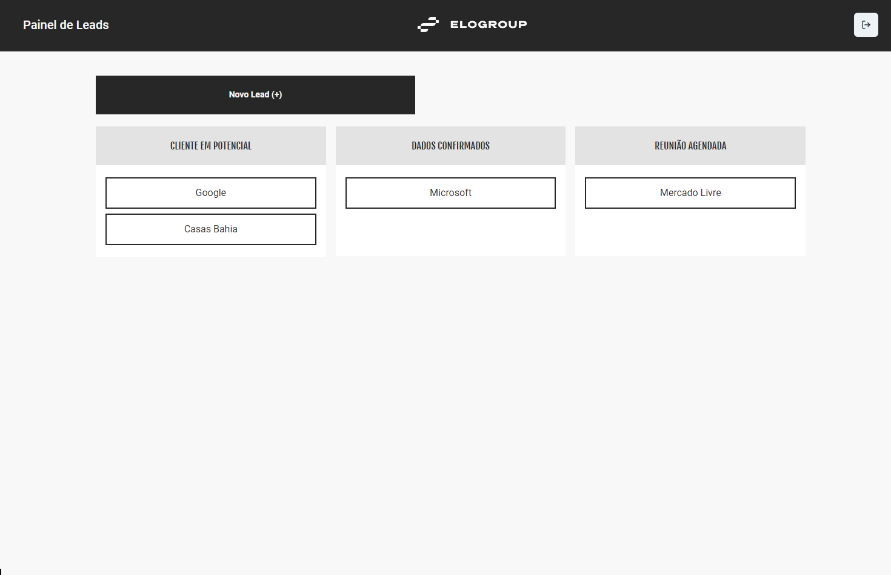
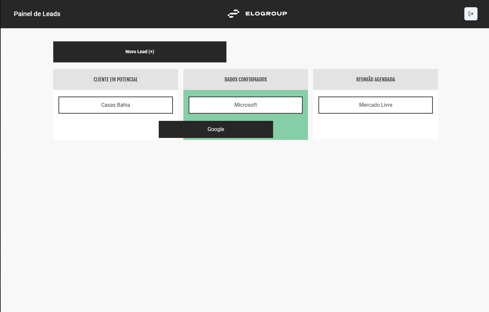
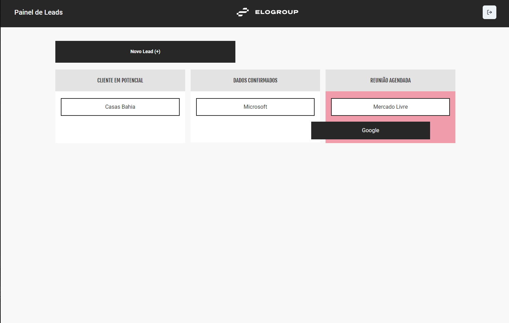
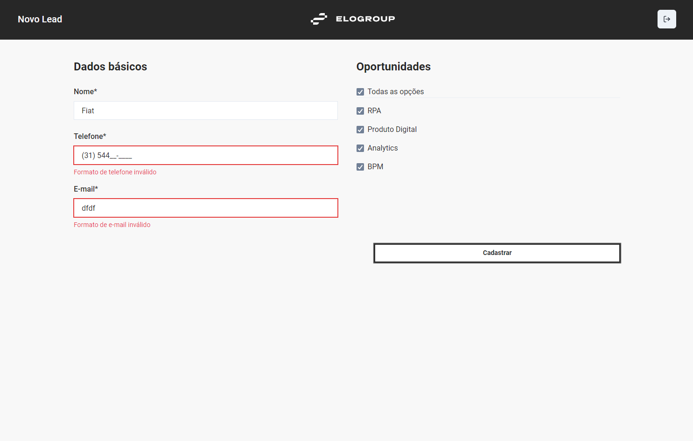
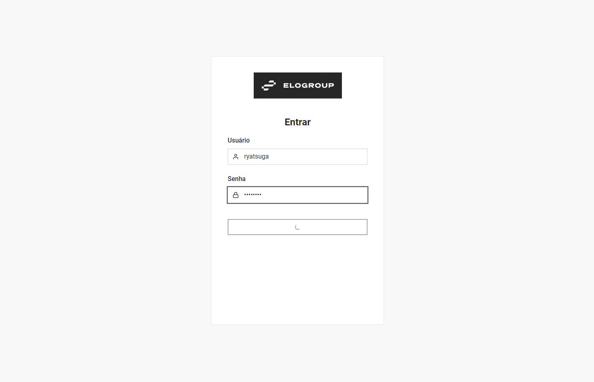
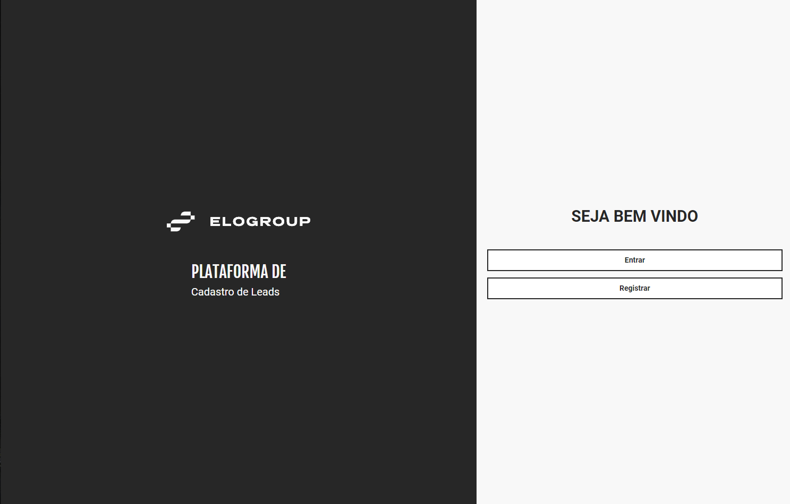
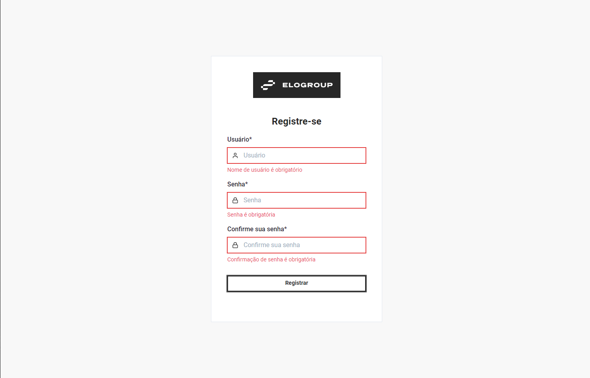
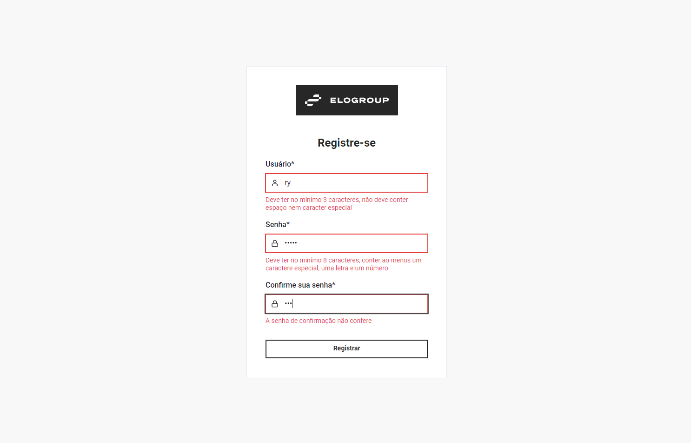
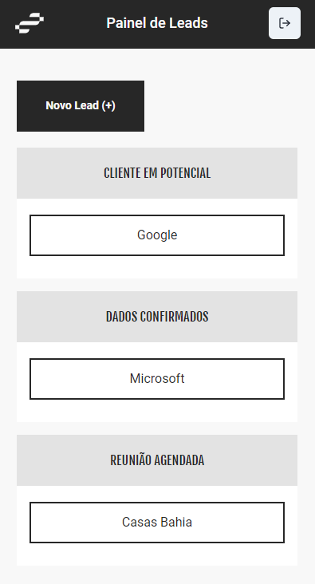
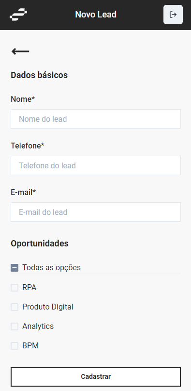

# EloGroup Leads

Projeto a ser submetido ao crack-the-code da EloGroup

## Getting Start

Este é um projeto construído com ReactJS

1. Clone este repositório
2. Acesse o dir do projeto e rode 'yarn' ou 'npm i' para instalar as dependências
3. Use 'yarn start' ou 'npm run start' para rodar o servidor e acessar o web app

## Highlighted Skills

- ReactJS
- Chakra UI (Melhorada durante o desafio)
- React Beatiful DnD (Aprendida durante o desafio)

## Printscreens

